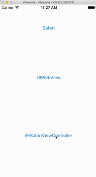

##  Share Plugin for Xamarin and Windows

Simple way to share a message or link, copy text to clipboard, or open a browser in any Xamarin or Windows app.

#### Setup

* Available on NuGet: https://www.nuget.org/packages/Plugin.Share/ [](https://www.nuget.org/packages/Share.Plugin/)
* Install into your PCL project and Platform Specific projects

Build Status: [](https://ci.appveyor.com/project/JamesMontemagno/shareplugin)

**Platform Support**

|Platform|Supported|Version|
| ------------------- | :-----------: | :------------------: |
|Xamarin.iOS|Yes|iOS 7+|
|Xamarin.iOS Unified|Yes|iOS 7+|
|Xamarin.Android|Yes|API 14+|
|Windows Phone Silverlight|Yes|8.0+|
|Windows Phone RT|Yes|8.1+|
|Windows Store RT|Yes|8.1+|
|Windows 10 UWP|Yes|10+|
|Xamarin.Mac|No||
### API Usage

Call **CrossShare.Current** from any project or PCL to gain access to APIs.

**Share**
```csharp
/// <summary>
/// Simply share text on compatible services
/// </summary>
/// <param name="text">Text to share</param>
/// <param name="title">Title of popup on share (not included in message)</param>
/// <returns>awaitable Task</returns>
Task Share(string text, string title = null);
```

**Share Link**
```csharp
/// <summary>
/// Share a link url with compatible services
/// </summary>
/// <param name="url">Link to share</param>
/// <param name="message">Message to share</param>
/// <param name="title">Title of the popup</param>
/// <returns>awaitable Task</returns>
Task ShareLink(string url, string message = null, string title = null);
```

## Clipboard
The ability to set text directly on the clipboard. All Operating systems support this except for Windows Phone 8.1 RT

```csharp
/// <summary>
/// Sets text on the clipboard
/// </summary>
/// <param name="text">Text to set</param>
/// <param name="label">Label to dislay (not required, Android only)</param>
/// <returns></returns>
Task<bool> SetClipboardText(string text, string label = null);

/// <summary>
/// Gets if clipboard is supported
/// </summary>
bool SupportsClipboard { get; }
```


**Open Browser**
```csharp
/// <summary>
/// Open a browser to a specific url
/// </summary>
/// <param name="url">Url to open</param>
/// <param name="options">Platform specific options</param>
/// <returns>awaitable Task</returns>
Task OpenBrowser(string url, BrowserOptions options = null);
```

### OS Specific Options
You can set a few device specific options by passing in BrowserOptions. Passing in null uses standard defaults.

```csharp
/// <summary>
/// Platform specific Browser Options
/// </summary>
public class BrowserOptions
{
    /// <summary>
    /// iOS: Gets or Set to use the SFSafariWebViewController on iOS 9+ (recommended)
    /// Default is true
    /// </summary>
    public bool UseSafariWebViewController { get; set; } = true;
    /// <summary>
    /// iOS: Gets or sets to use reader mode (good for markdown files)
    /// Default is false
    /// </summary>
    public bool UseSafairReaderMode { get; set; } = false;
    /// <summary>
    /// Android: Gets or sets to display title as well as url in chrome custom tabs
    /// Default is true
    /// </summary>
    public bool ChromeShowTitle { get; set; } = true;
    /// <summary>
    /// Android: Gets or sets the toolbar color of the chrome custom tabs
    /// If null (default) will be default chrome color
    /// </summary>
    public ShareColor ChromeToolbarColor { get; set; } = null;
}
  ```
#### Android: Chrome Custom Tabs
[Chrome Custom Tabs](https://developer.chrome.com/multidevice/android/customtabs) give apps more control over their web experience, and make transitions between native and web content more seemless without having to resort to a WebView. We will attempte to use Chrome Custom Tabs in all scenarios, but will fall back to launching the browser when necessary.

This also gives your app really great performance:


#### iOS: SFSafariWebViewController
[SFSafariViewController](https://blog.xamarin.com/keep-users-engaged-with-ios-9s-sfsafariviewcontroller/) gives you a whole new way to display web content to users without having to navigate away from your application or roll your own complex web view.



## iOS Specific Support 

**Facebook doesn't support share :(***

Facebook stopped support for sharing, so we automatically remove them from the list. You can put it back in by overriding the ExcludedUIActivityTypes or adding more that you would like to remove.

In your ApplicationDelegate call:
```
ShareImplementation.ExcludedUIActivityTypes = new List<string>{ UIActivityType.PostToFacebook};
```

See this thread: http://stackoverflow.com/questions/29890747/ios-how-to-share-text-and-image-on-social-networks

#### Maintaners
* [Jakob Gürtl](https://github.com/jguertl)
* [James Montemagno](https://github.com/jamesmontemagno)

#### License
Licensed under MIT license
