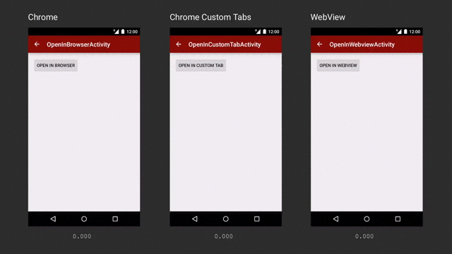

##  Share Plugin for Xamarin and Windows

Simple way to share a message or link, copy text to clipboard, or open a browser in any Xamarin or Windows app.

#### Setup

* Available on NuGet: https://www.nuget.org/packages/Plugin.Share/ [](https://www.nuget.org/packages/Plugin.Share/)
* Install into your PCL project and Platform Specific projects

Build Status: [](https://ci.appveyor.com/project/JamesMontemagno/shareplugin)

#### Don't update the NuGet for CustomTabs
I know you really want to upate the Custom Tabs NuGet for some reason, but don't as there are serious changes and I haven't built against it yet. Use the approved NuGet.

**Platform Support**

|Platform|Supported|Version|
| ------------------- | :-----------: | :------------------: |
|Xamarin.iOS|Yes|iOS 8+|
|Xamarin.Android|Yes|API 14+|
|Windows Phone Silverlight|Yes|8.0+|
|Windows Phone RT|Yes|8.1+|
|Windows Store RT|Yes|8.1+|
|Windows 10 UWP|Yes|10+|
|Xamarin.Mac|No||
### API Usage

Call **CrossShare.Current** from any project or PCL to gain access to APIs.

Documentation below represents version 5.0+:

**Share Message or Link**
```csharp
/// <summary>
/// Share a message with compatible services
/// </summary>
/// <param name="message">Message to share</param>
/// <param name="options">Platform specific options</param>
/// <returns>True if the operation was successful, false otherwise</returns>
Task<bool> Share(ShareMessage message, ShareOptions options = null);
```
ShareMessage has the follow:
```csharp
/// <summary>
/// Message object to share with compatible services
/// </summary>
public class ShareMessage
{
    /// <summary>
    /// Gets or sets the title of the message. Used as email subject if sharing with mail apps.
    /// </summary>
    public string Title { get; set; }

    /// <summary>
    /// Gets or sets the text of the message.
    /// </summary>
    public string Text { get; set; }

    /// <summary>
    /// Gets or sets the link to include with the message.
    /// </summary>
    public string Url { get; set; }
}
```

ShareOptions gives you additional control over iOS and Android:
```csharp
/// <summary>
/// Platform specific Share Options
/// </summary>
public class ShareOptions
{
    /// <summary>
    /// Android: Gets or sets the title of the app chooser popup.
    /// If null (default) the system default title is used.
    /// </summary>
    public string ChooserTitle { get; set; } = null;

    /// <summary>
    /// iOS: Gets or sets the UIActivityTypes that should not be displayed.
    /// If null (default) the value of <see cref="Plugin.Share.ShareImplementation.ExcludedUIActivityTypes"/> is used.
    /// </summary>
    public ShareUIActivityType[] ExcludedUIActivityTypes { get; set; } = null;
}
```

## Clipboard
The ability to set text directly on the clipboard. All Operating systems support this except for Windows Phone 8.1 RT

```csharp
/// <summary>
/// Sets text on the clipboard
/// </summary>
/// <param name="text">Text to set</param>
/// <param name="label">Label to dislay (not required, Android only)</param>
/// <returns></returns>
Task<bool> SetClipboardText(string text, string label = null);

/// <summary>
/// Gets if clipboard is supported
/// </summary>
bool SupportsClipboard { get; }
```


**Open Browser**
```csharp
/// <summary>
/// Open a browser to a specific url
/// </summary>
/// <param name="url">Url to open</param>
/// <param name="options">Platform specific options</param>
/// <returns>awaitable Task</returns>
Task OpenBrowser(string url, BrowserOptions options = null);
```

### OS Specific Options
You can set a few device specific options by passing in BrowserOptions. Passing in null uses standard defaults.

```csharp
/// <summary>
/// Platform specific Browser Options
/// </summary>
public class BrowserOptions
{
    /// <summary>
    /// iOS: Gets or sets to use the SFSafariWebViewController on iOS 9+ (recommended).
    /// Default is true.
    /// </summary>
    public bool UseSafariWebViewController { get; set; } = true;
    /// <summary>
    /// iOS: Gets or sets to use reader mode (good for markdown files).
    /// Default is false.
    /// </summary>
    public bool UseSafariReaderMode { get; set; } = false;
        
    /// <summary>
    /// iOS: Gets or sets the color to tint the background of the navigation bar and the toolbar (iOS 10+ only).
    /// If null (default) the default color will be used.
    /// </summary>
    public ShareColor SafariBarTintColor { get; set; } = null;
    /// <summary>
    /// iOS: Gets or sets the color to tint the control buttons on the navigation bar and the toolbar (iOS 10+ only).
    /// If null (default) the default color will be used.
    /// </summary>
    public ShareColor SafariControlTintColor { get; set; } = null;

    /// <summary>
    /// Android: Gets or sets to display title as well as url in chrome custom tabs.
    /// Default is true
    /// </summary>
    public bool ChromeShowTitle { get; set; } = true;
    /// <summary>
    /// Android: Gets or sets the toolbar color of the chrome custom tabs.
    /// If null (default) the default color will be used.
    /// </summary>
    public ShareColor ChromeToolbarColor { get; set; } = null;
}
  ```
#### Android: Chrome Custom Tabs
[Chrome Custom Tabs](https://developer.chrome.com/multidevice/android/customtabs) give apps more control over their web experience, and make transitions between native and web content more seemless without having to resort to a WebView. We will attempte to use Chrome Custom Tabs in all scenarios, but will fall back to launching the browser when necessary.

This also gives your app really great performance:



#### iOS: SFSafariWebViewController
[SFSafariViewController](https://blog.xamarin.com/keep-users-engaged-with-ios-9s-sfsafariviewcontroller/) gives you a whole new way to display web content to users without having to navigate away from your application or roll your own complex web view.


## iOS Specific Support 

**Facebook doesn't support share :(***

Facebook stopped support for sharing, so we automatically remove them from the list. You can put it back in by overriding the ExcludedUIActivityTypes or adding more that you would like to remove.

In your ApplicationDelegate call:
```
ShareImplementation.ExcludedUIActivityTypes = new List<string>{ UIActivityType.PostToFacebook};
```

or, you can specify this in your share options:
```csharp
CrossShare.Current.Share(new ShareMessage
{
	Text = "Follow @JamesMontemagno on Twitter",
	Title = "Share"
},
new ShareOptions
{
	ChooserTitle = "Chooser Title",
	ExcludedUIActivityTypes = new [] { ShareUIActivityType.PostToFacebook }
});
```

See this thread: http://stackoverflow.com/questions/29890747/ios-how-to-share-text-and-image-on-social-networks

#### Maintaners
* [Jakob Gürtl](https://github.com/jguertl)
* [James Montemagno](https://github.com/jamesmontemagno)

#### License
Licensed under MIT license
